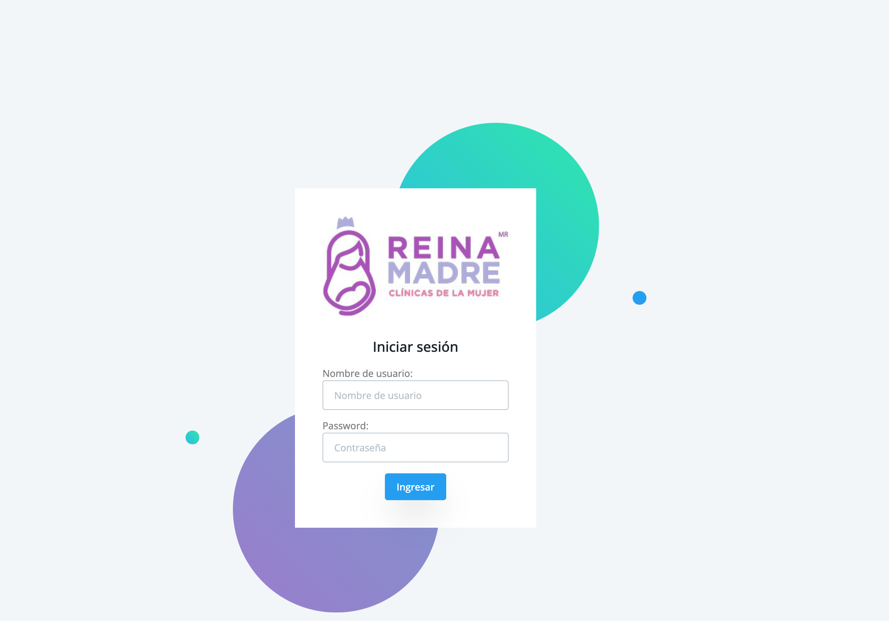
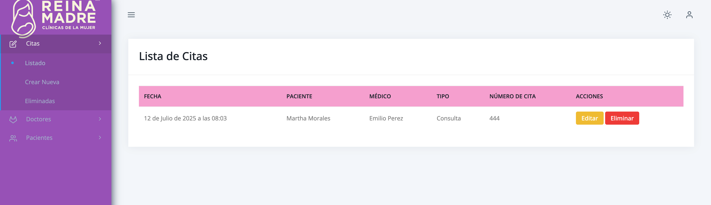

# Sistema de Gestión de Citas Médicas 🩺

Este es un sistema web desarrollado en Django para gestionar doctores, pacientes y citas médicas a través de una base de datos SQLite. Permite crear, editar, eliminar (lógico), y visualizar información con una interfaz moderna basada en Tailwind CSS.

## Características principales

- Gestión de pacientes, doctores y citas.
- Eliminación lógica de registros.
- Autenticación de usuarios (login/logout).
- Protección de vistas con login requerido.
- Mensajes con SweetAlert2.
- Formularios estilizados con Tailwind.
- Uso de `Select2` en campos tipo `select`.
- API REST protegida con token.
- Diseño responsive y moderno.

## Tecnologías usadas

- Python 3.10
- Django 5.2.4
- SQLite3
- Tailwind CSS
- Datta Able Template
- SweetAlert2
- jQuery
- Select2

## 📋 Prerrequisitos

Antes de iniciar con la instalación del proyecto, asegúrate de tener instalado lo siguiente:

- [Python 3.10+](https://www.python.org/downloads/)
- [pip](https://pip.pypa.io/en/stable/installation/)
- [Git](https://git-scm.com/downloads)
- [Virtualenv](https://virtualenv.pypa.io/en/latest/) (opcional pero recomendado)
- [SQLite3](https://www.sqlite.org/index.html) (ya viene con Python)

### Recomendado

- [Postman](https://www.postman.com/) – Para probar los endpoints de la API
- Editor de código como [VS Code](https://code.visualstudio.com/)

## Instalación

1. Clona el repositorio:
   ```bash
   git clone https://github.com/tu-usuario/tu-repo.git
   cd tu-repo
   ```
2.	Crea y activa el entorno virtual:
      ```bash
      python -m venv venv
      source venv/bin/activate  # En Windows: venv\Scripts\activate
      ```

3.	Instala los requisitos:
      ```bash
      pip install -r requirements.txt
      ```

4.	Realiza las migraciones:
      ```bash
      python manage.py migrate
      ```

5.	Ejecuta el servidor:
      ```bash
      python manage.py runserver
      ```

6.	Accede desde tu navegador:
       ```bash
       http://127.0.0.1:8000/
       ```
   Te aparecerá la pantalla de inicio de la aplicación:
   
## Crear superusuario

Para acceder al panel de administración de Django y gestionar modelos desde el backend, crea un superusuario con el siguiente comando:

```bash
python manage.py createsuperuser
```
Con este mismo usuario accederás a la aplicación desde el login:

 ```bash
http://127.0.0.1:8000/login/
```
Posteriormente, podrás visualizar la aplicación con sus respectivos módulos:


## Autenticación de los servicios

El proyecto utiliza autenticación basada en tokens para acceder a los endpoints de la API protegidos. Se implementa con `TokenAuthentication` de Django REST Framework.

### Cómo obtener un token de autenticación

1. Primero inicia sesión con un usuario válido (ya creado previamente).
2. Accede al endpoint `/api-token-auth/` enviando una petición `POST` con el nombre de usuario y contraseña:
```bash
curl -X POST http://127.0.0.1:8000/api-token-auth/ -d "username=admin&password=tu_contraseña"
```
3.	El servidor responderá con un JSON que contiene el token:
```bash
{"token": "aqui_va_el_token"}
```
4.	Para consumir los endpoints protegidos, incluye este token en el encabezado de tus peticiones:
```bash
Authorization: Token aqui_va_el_token
```
También puedes usar herramientas como Postman para facilitar estas pruebas.

## 📡 Endpoints disponibles

### 🔐 Autenticación
Permite obtener el token para acceder a las API protegidas.

| Método | Endpoint            | Descripción                         |
|--------|---------------------|-------------------------------------|
| POST   | `/api-token-auth/`  | Obtener token de autenticación      |

---

### 👤 Pacientes (`patients`)
CRUD completo de pacientes.

| Método | Endpoint                   | Descripción               |
|--------|----------------------------|---------------------------|
| GET    | `/api/patients/`           | Lista de pacientes        |
| GET    | `/api/patients/<id>/`      | Detalles de un paciente   |
| POST   | `/api/patients/`           | Crear nuevo paciente      |
| PUT    | `/api/patients/<id>/`      | Actualizar paciente       |
| DELETE | `/api/patients/<id>/`      | Eliminar paciente         |

---

### 🩺 Doctores (`doctors`)
CRUD completo de doctores.

| Método | Endpoint                  | Descripción              |
|--------|---------------------------|--------------------------|
| GET    | `/api/doctors/`           | Lista de doctores        |
| GET    | `/api/doctors/<id>/`      | Detalles de un doctor    |
| POST   | `/api/doctors/`           | Crear nuevo doctor       |
| PUT    | `/api/doctors/<id>/`      | Actualizar doctor        |
| DELETE | `/api/doctors/<id>/`      | Eliminar doctor          |

---

### 📅 Citas (`appointments`)
CRUD completo de citas médicas.

| Método | Endpoint                          | Descripción                     |
|--------|-----------------------------------|---------------------------------|
| GET    | `/api/appointments/`              | Lista de citas activas          |
| GET    | `/api/appointments/<id>/`         | Detalles de una cita            |
| POST   | `/api/appointments/`              | Crear nueva cita                |
| PUT    | `/api/appointments/<id>/`         | Actualizar cita                 |
| DELETE | `/api/appointments/<id>/`         | Eliminar cita (marcar eliminada)|

---

📌 **Nota:** Todos los endpoints protegidos requieren un token de autenticación en el encabezado:

## Créditos

Desarrollado por Martha Morales 👩🏻‍💻 como proyecto de práctica con Django + Tailwind + Plantilla Datta Able.